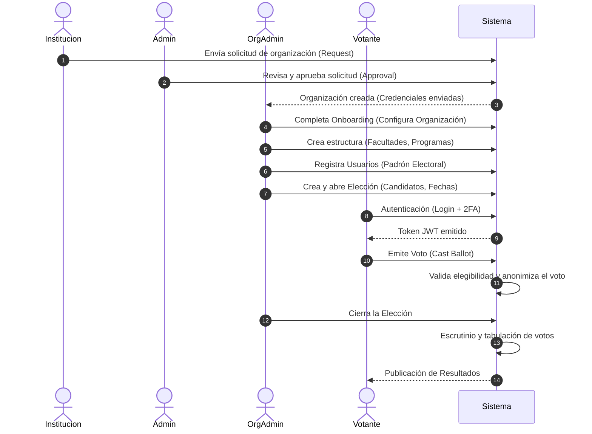

# Sistema Electoral CampusVote - Arquitectura y Flujo

Este documento describe de manera exhaustiva el flujo de negocio, la arquitectura del sistema, una auditoría técnica del código actual y un plan de trabajo recomendado para refactorización.

---

## 1. Flujo de Negocio Completo

El proceso del sistema de votación académica desde que una institución se registra hasta la publicación de resultados sigue el siguiente flujo de información:

1. **Solicitud de Organización (Lead):** Una institución (Universidad, Instituto, etc.) solicita la creación de una cuenta en la plataforma (`organization_requests`).
2. **Aprobación de la Solicitud:** Un Administrador del sistema (`ADMIN`) revisa la solicitud y la aprueba, lo cual dispara la creación de la Organización principal (`organizations`) y genera credenciales para el administrador de la institución.
3. **Configuración Inicial (Onboarding):** El Administrador de la Organización (`ORG_ADMIN`) completa el perfil y estructura los datos académicos de su institución (Facultades, Programas y Periodos Académicos).
4. **Carga del Padrón Electoral:** El administrador registra o importa a los usuarios (estudiantes y docentes) que participarán.
5. **Configuración de Elecciones:** Se crea el evento electoral, definiendo fechas, roles permitidos para votar y registrando los candidatos/listas.
6. **Votación:** Los votantes se autentican de manera segura (con JWT y validación OTP/2FA), visualizan las elecciones activas y emiten su voto. El sistema asegura el anonimato y la integridad del voto (registrando en `ballots` o tablas de votación).
7. **Escrutinio y Resultados:** Una vez cerrado el periodo de elección, el sistema computa los votos de manera automática e inmutable y los publica a los interesados.

### Diagrama del Flujo Principal

---

## 2. Arquitectura del Sistema

El sistema utiliza una arquitectura basada en **Capas (Layered Architecture)** con un enfoque de organización por **Módulos Basados en Funcionalidades (Feature-based Modular Design)**. 

### Componentes y Capas

- **Frontend:** *(No detallado en backend, pero se expone un directorio `/public` y vistas HTML)*.
- **Backend:** Desarrollado en **Node.js** con **Express.js** (ES Modules).
- **Base de Datos:** **PostgreSQL 15+** mediante el ORM **Prisma**. Además de usar tablas relacionales, integra lógica en SQL nativo para triggers y funciones transaccionales, como el bloqueo y aprobación de solicitudes.

### Capas dentro de un Módulo (`src/modules/*`)
1. **Routes (`*.routes.js`):** Define los endpoints de la API, aplica middlewares de autenticación, autorización (RBAC) y validadores (Zod).
2. **Controllers (`*.controller.js`):** Manejan las peticiones HTTP, extraen datos (req) y envían respuestas (res) usando utilidades compartidas.
3. **Services (`*.service.js`):** Contienen la lógica de negocio central, procesan los datos y deciden qué acciones tomar.
4. **Repositories (`*.repository.js`):** Encapsulan el acceso a la base de datos (consultas Prisma o SQL crudo), abstrayendo a los servicios de la capa de persistencia.

### Patrones de Diseño Detectados
- **Dependency Injection / Modularidad:** El código promueve el encapsulamiento separando en `/auth`, `/users`, `/organizations`, etc.
- **Repository Pattern:** Para separar la base de datos de la lógica.
- **Async/Await Wrapper (AsyncHandler):** Para capturar excepciones en controladores de manera centralizada sin `try/catch` repetitivos.

---

## 3. Auditoría de Código y Refactorización

Tras un análisis exhaustivo del código fuente, se identificaron varios problemas críticos (Deuda Técnica) que rompen la arquitectura propuesta e impiden el correcto funcionamiento de algunos módulos.

### A. Endpoints Huérfanos (Rutas Desconectadas)
El módulo `organizations` no está conectado a la aplicación. En `src/routes/index.js` únicamente se exponen los módulos `auth`, `users` y `health`. Esto significa que todas las funcionalidades relacionadas a las organizaciones (creación, onboarding, aprobaciones, listados) **son inalcanzables vía API**.
Adicionalmente, hay carpetas completamente vacías para módulos críticos (`academic`, `elections`, `voting`, `ballots`, `results`), lo que indica que estas funcionalidades aún no han sido desarrolladas.

### B. Llamadas Mal Hechas y Funciones Obsoletas
1. **Llamadas a funciones inexistentes en Controladores:**
   - En `src/modules/organizations/organization-request.controller.js`, se importa `organizationService` y se intentan usar métodos como `.listRequests()`, `.createRequest()`, `.approveRequest()`, y `.rejectRequest()`.
   - **El error:** Esos métodos **no existen** en `organization.service.js`. La lógica de peticiones y aprobaciones se separó en `request.service.js` y `approval.service.js` respectivamente. Esto provocará crashes inmediatos (`TypeError: organizationService.createRequest is not a function`).
   
2. **Repositorios Obsoletos vs. Servicios Acoplados (`users`):**
   - El archivo `user.repository.js` realiza consultas a Prisma utilizando convenciones de nombres en `snake_case` (ej: `first_name`, `is_active`). Sin embargo, el esquema real de Prisma (`user.prisma`) expone los campos generados para JS en `camelCase` (ej: `firstName`, `isActive`) usando `@map` para la base de datos.
   - **El error:** Si se intentara usar `user.repository.js`, fallaría. Como solución (temporal y mala práctica), `user.service.js` ignora el repositorio por completo e inyecta y utiliza la instancia de `prisma` de forma directa, rompiendo el patrón de repositorio y generando alta cohesión indeseada con la base de datos en la capa de servicios.

### C. Módulos Altamente Acoplados (El "God Object")
El archivo `src/modules/organizations/organization.repository.js` se ha convertido en un **God Object**. A pesar de pertenecer al dominio `organizations`, actualmente gestiona operaciones de base de datos para:
- Organizaciones
- Solicitudes de Organizaciones (Leads)
- Facultades (`faculties`)
- Programas Académicos (`programs`)
- Periodos Académicos (`academic_periods`)

Toda la estructura académica (`Facultades`, `Programas`, `Periodos`) pertenece estrictamente a un dominio diferente (`academic`). De hecho, existe un directorio vacío `src/modules/academic` esperando recibir este código.

---

## 4. Plan de Trabajo Recomendado

Para corregir los problemas estructurales y dejar el proyecto en condiciones de escalabilidad y paso a producción, se recomienda ejecutar el siguiente plan priorizado:

### Prioridad Alta (Crítica - Funcionalidad Rota)
1. **Conectar el módulo de Organizaciones:** 
   - Importar y montar `organization.routes.js` dentro de `src/routes/index.js`.
2. **Corregir los controladores de `organizations`:** 
   - Refactorizar `organization-request.controller.js` para que importe y utilice los servicios correctos (`request.service.js` y `approval.service.js`) en lugar de llamar métodos inexistentes en `organization.service.js`. De manera alternativa, removerlo por completo y usar `request.controller.js` ajustando las importaciones en `organization.routes.js`.
3. **Corregir el repositorio de Usuarios (`user.repository.js`):** 
   - Modificar las proyecciones y filtros para que usen `camelCase` conforme al Prisma Schema (`firstName`, `institutionalId`, `isActive`, etc.).
   - Refactorizar `user.service.js` para que abandone el acceso directo a `prisma` y comience a consumir los métodos reparados del `user.repository.js`.

### Prioridad Media (Deuda Técnica y Cohesión Arquitectónica)
1. **Desacoplar el "God Object" `organization.repository.js`:**
   - Extraer todas las operaciones relacionadas a Facultades, Programas y Periodos Académicos hacia repositorios y servicios propios dentro del directorio (actualmente vacío) `src/modules/academic/`.
   - Crear los controladores y rutas (endpoints HTTP) para estas entidades académicas, los cuales actualmente ni siquiera existen.
2. **Separación de Request y Approval:**
   - Evaluar si las Solicitudes (`requests`) deben convivir en la misma ruta de `organizations` o si ameritan un endpoint propio (ej. `/api/leads` o `/api/requests`).

### Prioridad Baja (Escalabilidad y Desarrollo Futuro)
1. **Implementar los Módulos Faltantes:**
   - Iniciar el diseño e implementación de las lógicas en los directorios vacíos en el orden del flujo de negocio: `elections` -> `voting` -> `ballots` -> `results`.
2. **Homogeneizar Nomenclatura:**
   - Garantizar que todo el sistema utilice consistemente `camelCase` en JS/Node y `snake_case` únicamente en la definición del schema de base de datos a nivel físico (vía el tag `@map`).
3. **Tests Unitarios Faltantes:**
   - Hay pruebas para `request.controller.js` pero no se asegura que estos controladores estén enchufados en el ruteo central. Actualizar y correr los tests (`npm run test`) regularmente tras estas refactorizaciones masivas.
